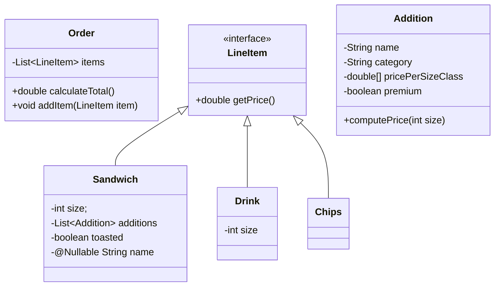
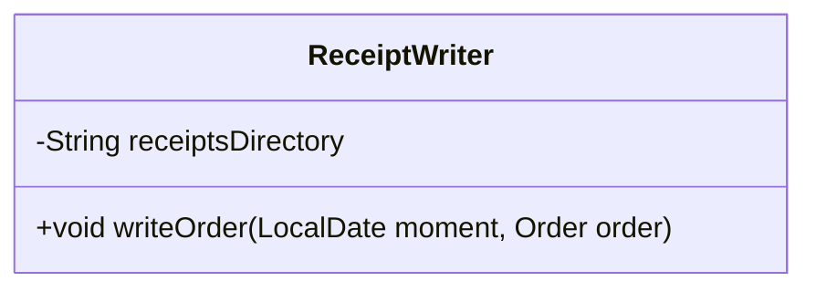
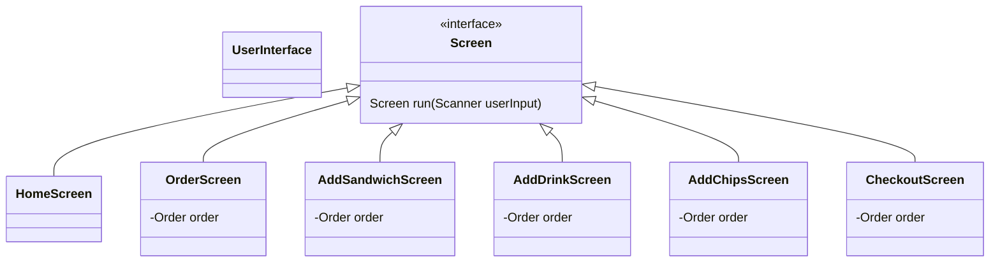

## Orders

```mermaid
classDiagram
    class Order {
        -List&lt;LineItem&gt; items
        +double calculateTotal()
        +void addItem(LineItem item)
    }
    class LineItem {
        <<interface>>
        +double getPrice()
    }
    
    LineItem <|-- Sandwich
    class Sandwich {
        -int size;
        -List&lt;Addition&gt; additions
        -boolean toasted
        -@Nullable String name
    }
    class Addition {
        -String name
        -String category
        -double[] pricePerSizeClass
        -boolean premium
        +computePrice(int size)
    }
    
    LineItem <|-- Drink
    class Drink {
        -int size
    }
    LineItem <|-- Chips
    class Chips {
        
    }
```

## Data Files

```mermaid
classDiagram
    class ReceiptWriter {
        -String receiptsDirectory
        +void writeOrder(LocalDate moment, Order order)
    }
```

## UI

```mermaid
classDiagram
    class UserInterface
    class Screen {
        <<interface>>
        Screen run(Scanner userInput)
    }
    
    Screen <|-- HomeScreen
    class HomeScreen
    Screen <|-- OrderScreen
    class OrderScreen {
        -Order order
    }
    Screen <|-- AddSandwichScreen
    class AddSandwichScreen {
        -Order order
    }
    Screen <|-- AddDrinkScreen
    class AddDrinkScreen {
        -Order order
    }
    Screen <|-- AddChipsScreen
    class AddChipsScreen {
        -Order order
    }
    Screen <|-- CheckoutScreen
    class CheckoutScreen {
        -Order order
    }
```

For fun, we're structuring the UI flow around classes whose `run()` method
returns the next screen to enter.
If it is `null`, the UI exits.
