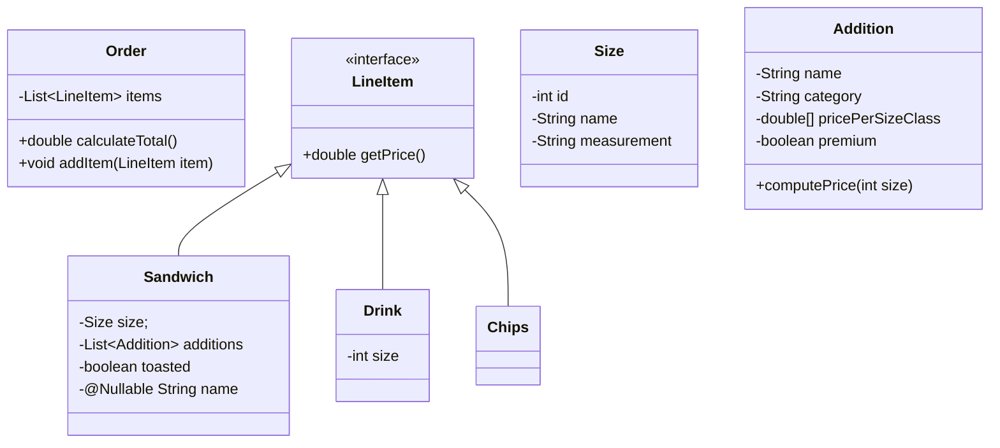
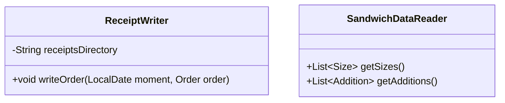
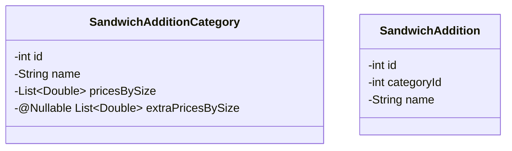
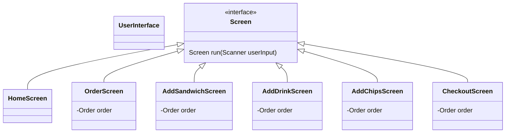

## Orders

## Data Files

### Private Data Reader Classes
The following classes are not usable outside of `com.pluralsight.data`.
They are relevant only to the internals around reading and writing
the files we're working with.

## UI

For fun, we're structuring the UI flow around classes whose `run()` method
returns the next screen to enter.
If it is `null`, the UI exits.
