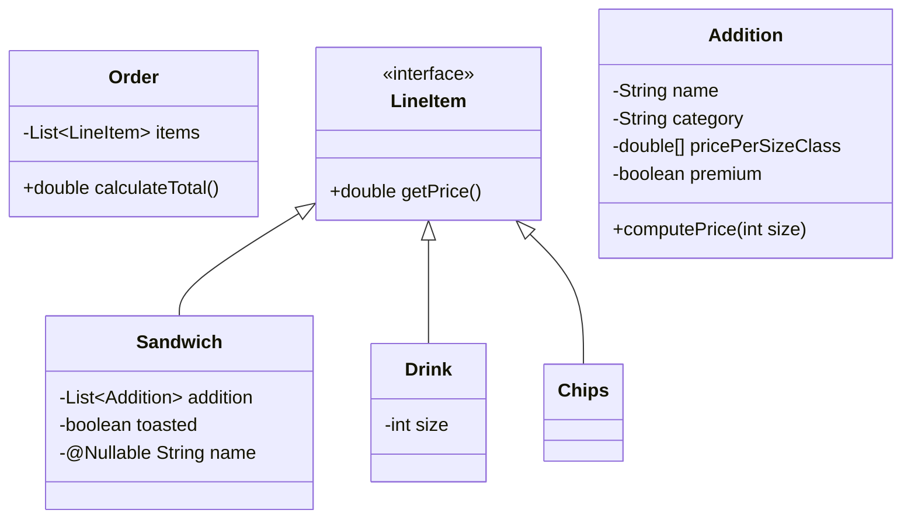

```mermaid
classDiagram
    class Order {
        -List&lt;LineItem&gt; items
        +double calculateTotal()
    }
    class LineItem {
        <<interface>>
        +double getPrice()
    }
    
    LineItem <|-- Sandwich
    class Sandwich {
        -List&lt;Addition&gt; addition
        -boolean toasted
        -@Nullable String name
    }
    class Addition {
        -String name
        -String category
        -double[] pricePerSizeClass
        -boolean premium
        +computePrice(int size)
    }
    
    LineItem <|-- Drink
    class Drink {
        -int size
    }
    LineItem <|-- Chips
    class Chips {
        
    }
```
